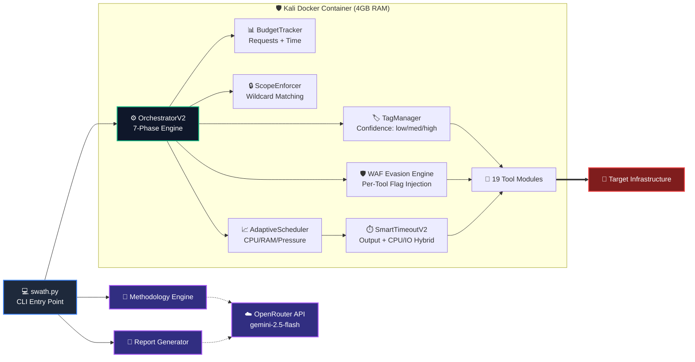
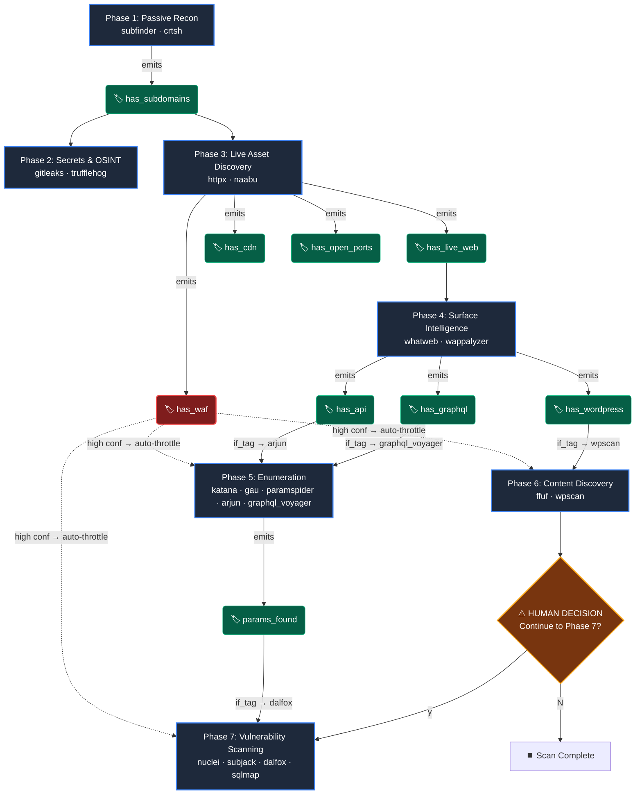
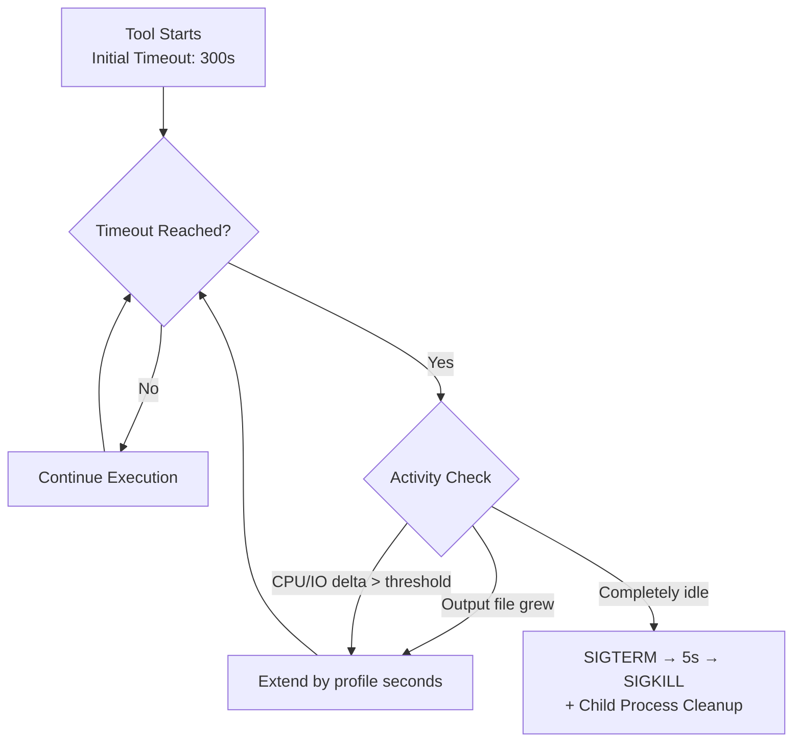
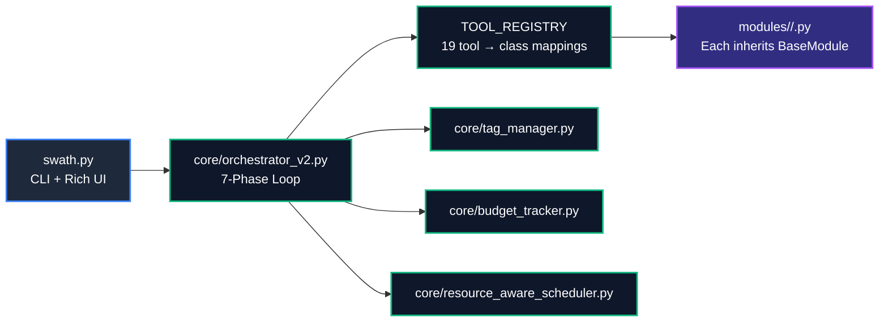

<div align="center">

```
 ██╗  ██╗██╗   ██╗██████╗ ███╗   ██╗███████╗███████╗████████╗
 ██║  ██║██║   ██║██╔══██╗████╗  ██║██╔════╝██╔════╝╚══██╔══╝
 ███████║██║   ██║██████╔╝██╔██╗ ██║█████╗  ███████╗   ██║   
 ██╔══██║██║   ██║██╔══██╗██║╚██╗██║██╔══╝  ╚════██║   ██║   
 ██║  ██║╚██████╔╝██║  ██║██║ ╚████║███████╗███████║   ██║   
 ╚═╝  ╚═╝ ╚═════╝ ╚═╝  ╚═╝╚═╝  ╚═══╝╚══════╝╚══════╝   ╚═╝   
                    ⚔️  RED-TEAM RECON ORCHESTRATOR
```

**Surgical reconnaissance for professional bug bounty hunters.**  
31 curated tools (including JS Analysis, API Testing, Cloud Discovery). Autonomous WAF evasion. Tag-driven conditional execution.  
Zero noise. Maximum signal.

[](https://www.python.org/downloads/)
[](LICENSE)
[](Dockerfile.kali)
[](https://openrouter.ai/)
[](#-7-phase-execution-pipeline)
[](#-scope-enforcement)

[Features](#-key-features) · [Architecture](#-architecture--tag-flow) · [Installation](#-installation) · [CLI Reference](#-cli-reference) · [Tool Arsenal](#-tool-arsenal--detection-matrix) · [Dashboard](#-dashboard) · [Contributing](#-contributing)

---

</div>

## What is SWATH?

SWATH is a strict, containerized reconnaissance orchestrator designed for operators who value **signal over noise**. Built on the principle that most recon frameworks are bloated museum exhibits of deprecated tools, SWATH runs exactly 31 curated tools through a 7-phase pipeline governed by intelligence tags — not blind sequential execution. Now armed with a Metasploit-style interactive console and continuous monitoring diff engine, it is the ultimate professional web penetration framework.

Phase 3 detects a Cloudflare WAF at high confidence? Every downstream tool auto-injects rate limiting and browser User-Agents. Phase 4 fingerprints WordPress? Phase 6 conditionally unlocks `wpscan`. Phase 1 finds zero subdomains? The pipeline aborts — there's nothing to hunt.

### The Four Pillars

| Pillar | Principle | Implementation |
|:---|:---|:---|
| **Surgical Precision** | 19 curated tools, not 50 legacy wrappers | Every tool in the registry justifies its slot against detection risk vs. intelligence yield |
| **Autonomous WAF Evasion** | Detect → adapt → survive | Phase 3 `httpx` parses WAF signatures; `base_module._run_subprocess()` injects per-tool evasion flags when `has_waf` confidence = `high` |
| **Tag-Driven Conditional Execution** | Non-linear: tags unlock phases, not sequence | `TagManager` never downgrades confidence. `if_tag` gates in YAML prevent irrelevant tools from firing |
| **Resource-Aware Scheduling** | No OOM, no system freezes | `AdaptiveScheduler` + `SmartTimeoutV2` + `ResourceMonitor` dynamically scale threads, extend active processes, and kill hung ones |

---

## Key Features

- **Metasploit-Style Interactive Console** — Run `swath interactive` to drop into a REPL environment. Use `use example.com`, `set profile ninja`, `scan quick`, `show findings`, and `export json` just like Metasploit.
- **Continuous Monitoring & Diffing** — Run `swath monitor target.com` to schedule recurring scans. The new `DiffEngine` compares historical SQLite database records and alerts on new subdomains, changed technologies, and open ports.
- **Auto-Discovery Plugin System** — Just drop a `.py` file inheriting `BaseModule` into the `modules/` folder, and the orchestrator dynamically loads it. No hardcoded registries.
- **Persistent SQLite Database** — All targets, assets, findings, and changes are stored persistently in `~/.swath/history.db` for cross-scan intelligence.
- **Multi-Channel Notification Hub** — Async alerts pushed to Discord, Slack, or Telegram the second a critical vulnerability or new asset is found.
- **Bounty & Export Engine** — Track your HackerOne/Bugcrowd bounty stats via `BountyManager`. Export findings seamlessly to Markdown, CSV, JSON, or HackerOne template formats.
- **AI Methodology Engine** — Describe your goal in plain English. OpenRouter (`gemini-2.5-flash`) generates a surgical YAML methodology with correct phase keys, tool names, and conditional gates.
- **AI Executive Reports** — Post-scan, tags + raw output are synthesized into a professional Markdown penetration report with severity classifications.
- **Autonomous WAF Evasion** — Detects WAFs and auto-injects rate limiting + UA rotation based on Stealth Profiles (`ghost`, `ninja`, `blitz`).
- **Tag-Driven Conditional Execution** — Tools run only when prerequisite intelligence tags exist. `has_wordpress` → `wpscan`. `has_api` → `arjun`. `params_found` → `dalfox`.
- **Human Decision Point** — Phase 7 (vulnerability scanning) requires explicit `y/N` confirmation. You review the recon summary before any noisy vuln scans fire.
- **Resource-Aware Scheduling** — `AdaptiveScheduler` scales tool parameters to fit available RAM. `ResourceMonitor` checks CPU pressure, swap usage, and user activity before scheduling heavy tools.
- **State Checkpointing** — Saves `completed_tools`, `tags`, and `phase` after every tool. `swath resume target.com` picks up exactly where it stopped.
- **Scope Enforcement** — Wildcard-based scope matching in `~/.swath/scope.json`. Blocks out-of-scope targets with manual override confirmation.
- **Docker Isolation** — All tools execute inside a hardened Kali container. 4GB memory limit, non-root user, volume-mounted output.

---

## Architecture & Tag Flow

### System Topology



### Tag Propagation & Conditional Execution



---

## 7-Phase Execution Pipeline

| Phase | Label | Tools | Key Tags Emitted | Weight | Human Gate |
|:---|:---|:---|:---|:---|:---|
| **1** | Passive Recon | `subfinder`, `crtsh` | `has_subdomains` | Light | — |
| **2** | Secrets & OSINT | `gitleaks`, `trufflehog` | `leaked_credentials` | Light | — |
| **3** | Live Asset Discovery | `httpx`, `naabu` | `has_live_web`, `has_waf`, `has_cdn`, `has_open_ports` | Medium | — |
| **4** | Surface Intelligence | `whatweb`, `wappalyzer` | `has_tech_intel`, `has_wordpress`, `has_api`, `has_graphql` | Medium | — |
| **5** | Enumeration | `katana`, `gau`, `paramspider`, `arjun`, `graphql_voyager` | `params_found`, `hidden_params_found` | Medium | — |
| **6** | Content Discovery | `ffuf`, `wpscan` | `admin_panel_found`, `backup_files_found` | Heavy | — |
| **7** | Vulnerability Scanning | `nuclei`, `subjack`, `dalfox`, `sqlmap` | `has_vulnerabilities`, `has_critical_vulns`, `xss_found`, `sqli_found` | Heavy | **`y/N` Required** |

**Phase 7 — Human Decision Point:** Before any vulnerability scanning begins, the orchestrator displays a recon summary (subdomain count, live hosts, tech stack, critical tags) and requires explicit user confirmation. This prevents accidental noise against production infrastructure.

---

## Tool Arsenal & Detection Matrix

| # | Tool | Binary | Phase | Category | Detection Risk | Defender Visibility | Weight |
|:--|:-----|:-------|:------|:---------|:---------------|:-------------------|:-------|
| 1 | subfinder | `subfinder` | 1 | passive | **None** | 0% — Completely invisible to target SOC | Light |
| 2 | crtsh | — (API) | 1 | passive | **None** | 0% — Queries crt.sh, never touches target | Light |
| 3 | gitleaks | `gitleaks` | 2 | secrets | **None** | 0% — Operates entirely locally | Light |
| 4 | trufflehog | `trufflehog` | 2 | secrets | **None** | 0% — Operates locally on downloaded data | Light |
| 5 | httpx | `httpx` | 3 | discovery | **Low** | 20% — WAF/CDN logs show mass HTTP GET requests | Medium |
| 6 | naabu | `naabu` | 3 | discovery | **High** | 80% — Core firewalls alert on SYN sweeps | Heavy |
| 7 | dnsx | `dnsx` | 3 | discovery | **Low** | 10% — Active DNS resolution mapping | Light |
| 8 | tlsx | `tlsx` | 3 | discovery | **Low** | 15% — Certificate and cipher enumeration | Light |
| 9 | whatweb | `whatweb` | 4 | surface_intel | **Low** | 15% — Quick HEAD/GET probes per host | Light |
| 10 | wappalyzer | `wappalyzer` (npm) | 4 | surface_intel | **Low** | 15% — Technology fingerprinting via headers | Medium |
| 11 | katana | `katana` | 5 | enumeration | **Medium** | 40% — Looks like an aggressive bot/scraper | Medium |
| 12 | gau | `gau` | 5 | enumeration | **Low** | 0% — Queries Wayback/CommonCrawl, not target | Medium |
| 13 | paramspider | `python3 paramspider.py` | 5 | enumeration | **Low** | 10% — Fetches known URLs from external sources | Light |
| 14 | arjun | `arjun` | 5 | enumeration | **Medium** | 30% — Sends parameter probes to target | Light |
| 15 | graphql_voyager | — (HTTP) | 5 | enumeration | **Low** | 5% — Introspection queries against GraphQL endpoints | Light |
| 16 | ffuf | `ffuf` | 6 | content_discovery | **High** | 95% — Triggers WAF rules for directory brute forcing | Heavy |
| 17 | wpscan | `wpscan` | 6 | content_discovery | **Medium** | 50% — WordPress enumeration is detectable | Medium |
| 18 | linkfinder | `linkfinder.py` | 8 | js_analysis | **Low** | 5% — Scrapes JS files for endpoints | Light |
| 19 | secretfinder | `secretfinder.py` | 8 | js_analysis | **Low** | 5% — Extracts keys/tokens from JS files | Light |
| 20 | retirejs | `retire` (npm) | 8 | js_analysis | **Low** | 0% — Local analysis of downloaded libraries | Light |
| 21 | kiterunner | `kr` | 9 | api_testing | **High** | 90% — Aggressive API route brute forcing | Heavy |
| 22 | jwt_tool | `jwt_tool.py` | 9 | api_testing | **Medium** | 40% — Forges and manipulates auth tokens | Medium |
| 23 | cloudenum | `cloud_enum` | 10 | cloud | **Low** | 10% — Queries AWS/GCP/Azure public APIs | Light |
| 24 | s3scanner | `s3scanner` | 10 | cloud | **Low** | 20% — Tests public accessibility of buckets | Light |
| 25 | nuclei | `nuclei` | 7 | vuln_scan | **High** | 99% — SIEM alerts on standard Nuclei payloads/headers | Heavy |
| 26 | subjack | `subjack` | 7 | vuln_scan | **Low** | 5% — Simple DNS resolution + selective HTTP GET | Medium |
| 27 | dalfox | `dalfox` | 7 | vuln_scan | **High** | 100% — Highly noisy, triggers basic XSS WAF rules | Heavy |
| 28 | sqlmap | `sqlmap` | 7 | vuln_scan | **High** | 95% — SQL injection payloads are signature-matched | Heavy |
| 29 | corsy | `corsy.py` | 7 | vuln_scan | **Medium** | 50% — Origin reflection testing | Medium |
| 30 | crlfuzz | `crlfuzz` | 7 | vuln_scan | **Medium** | 60% — Header injection probes | Medium |
| 31 | openredirect | `oralyzer.py` | 7 | vuln_scan | **High** | 80% — Fuzzes parameters for URL redirects | Heavy |

> **Operational Note:** Tools at detection risk "High" should only be run against targets where you have explicit authorization. Phase 7 requires manual confirmation for this reason.

---

## WAF Evasion System

### Detection Logic

When `httpx` parses responses during Phase 3, it checks technology signatures, webserver names, and HTTP headers against a curated WAF fingerprint database:

| Signal Type | Examples | Confidence |
|:---|:---|:---|
| Tech signature | `cloudflare-waf`, `akamai-waf`, `imperva-securesphere`, `sucuri-waf` | **High** |
| Tech signature | `cloudflare` (CDN only), `imperva` (generic) | Medium |
| Webserver | `cloudflare`, `incapsula`, `sucuri` | High |
| HTTP headers | `cf-ray`, `x-sucuri-id`, `x-protected-by`, `x-waf-event-info` | Medium |

### Confidence Gating

**WAF evasion ONLY triggers when `has_waf` tag has `high` confidence.** Medium confidence (e.g., generic Cloudflare CDN detection without WAF confirmation) does **not** trigger evasion. This prevents false-positive slowdowns on targets behind CDNs that aren't actively filtering requests.

### Per-Tool Evasion Injection Table

| Tool | Injected Flags | Effect |
|:-----|:---------------|:-------|
| `nuclei` | `-rl 5`, `-H "User-Agent: {browser_ua}"` | 5 req/s, rotating browser UA |
| `katana` | `-rl 5`, `-H "User-Agent: {browser_ua}"` | 5 req/s, rotating browser UA |
| `ffuf` | `-rate 5`, `-H "User-Agent: {browser_ua}"` | 5 req/s, rotating browser UA |
| `dalfox` | `--worker 5`, `--delay 200`, `-H "User-Agent: {browser_ua}"` | 5 workers, 200ms delay, browser UA |
| `wpscan` | `--throttle 200`, `--user-agent {browser_ua}` | 200ms throttle, browser UA |
| `sqlmap` | `--delay 0.2`, `--random-agent` | 200ms delay, random UA per request |
| `whatweb` | `--max-threads 2`, `--header "User-Agent: {browser_ua}"` | 2 threads, browser UA |
| `httpx` | `-rl 10`, `-H "User-Agent: {browser_ua}"` | 10 req/s, rotating browser UA |

User-Agent pool rotates across 4 real browser signatures (Chrome/Windows, Safari/macOS, Firefox/Linux, Firefox/Windows). Injection is transparent — no manual configuration required.

---

## Quick Start Guide

You now have two primary ways to run SWATH: the **Interactive Console** (designed for manual, professional bug hunting) and the **Standard CLI** (designed for automation).

### 1. The Interactive Console (Metasploit Style)
This is your primary workspace. Drop into the interactive shell by running:
```bash
python swath.py interactive
```

Once inside the `swath >` prompt, you can use these commands:
- **Set a Target**: `use example.com` (Sets the scope and active target)
- **Configure Profiles**: `set profile ninja` (Applies rate limiting and WAF evasion)
- **Run Scans**: `scan quick` or `scan full`
- **Review Results**: `findings`, `assets`, or `modules`
- **List Targets**: `targets`
- **Export Data**: `export hackerone` or `export json`

### 2. The Continuous Monitor
If you want to track a target over time and get alerted when new subdomains appear or ports open:
```bash
python swath.py monitor example.com
```
*Tip: You can add this command to a cron job or scheduled task to run automatically every 24 hours.*

### 3. Standard CLI Mode
If you prefer traditional one-liner commands (great for CI/CD or background tasks):
- **Standard Scan**: `python swath.py scan example.com`
- **AI-Generated Methodology**: `python swath.py ai "Find PII leaks on subdomains"`
- **Generate Report**: `python swath.py report example.com`

---

## Installation

### Prerequisites

| Requirement | Minimum | Recommended |
|:---|:---|:---|
| Docker + Compose V2 | Installed | Latest stable |
| Python | 3.9+ | 3.11+ |
| RAM | 2 GB free | 8 GB free |
| Disk | 10 GB | 30 GB |
| OS | Linux, macOS, Windows (WSL2) | Linux |

### Docker Deployment (Recommended)

```bash
git clone https://github.com/SWATHHQ/swath.git && cd swath

cp .env.example .env
# Edit .env — set OPENROUTER_API_KEY (required for AI features)

docker-compose up -d --build

# Verify container is running
docker ps | grep swath-kali

# Run your first scan
python3 swath.py scan example.com
```

The Docker container (`kalilinux/kali-rolling` base) includes all 19 tools (16 Go/system binaries + 3 API/Python modules), Node.js/Wappalyzer, and Kali-packaged security tools. Memory is capped at 4GB with auto-restart enabled.

### Bare-Metal Installation

```bash
git clone https://github.com/SWATHHQ/swath.git && cd swath

cp .env.example .env

python3 -m venv venv
source venv/bin/activate
pip install -r requirements.txt

# Install Go-based tools manually
go install github.com/projectdiscovery/subfinder/v2/cmd/subfinder@latest
go install github.com/projectdiscovery/httpx/cmd/httpx@latest
go install github.com/projectdiscovery/naabu/v2/cmd/naabu@latest
go install github.com/projectdiscovery/katana/cmd/katana@latest
go install github.com/projectdiscovery/nuclei/v3/cmd/nuclei@latest
go install github.com/lc/gau/v2/cmd/gau@latest
go install github.com/hahwul/dalfox/v2@latest
go install github.com/haccer/subjack/v2/cmd/subjack@latest
nuclei -update-templates

# Install system tools (Debian/Ubuntu)
sudo apt install ffuf wpscan sqlmap whatweb gitleaks trufflehog

# Install Wappalyzer CLI
npm install -g wappalyzer

python3 swath.py scan example.com
```

### Environment Variables

| Variable | Required | Default | Purpose |
|:---|:---|:---|:---|
| `OPENROUTER_API_KEY` | Yes (AI features) | — | OpenRouter API key for methodology generation + reports |
| `OPENROUTER_MODEL` | No | `google/gemini-2.5-flash` | LLM model for AI features |
| `OPENROUTER_API_URL` | No | `https://openrouter.ai/api/v1/chat/completions` | Override the OpenRouter API endpoint URL |
| `GITHUB_TOKEN` | No | — | Available in container environment for trufflehog/gitleaks (passthrough, not explicitly injected by orchestrator) |
| `WPSCAN_API_TOKEN` | No | — | WordPress vulnerability database access for `wpscan` |

---

## CLI Reference

```
usage: swath <command> [options]

Commands:
  scan <domain>              Run a 7-phase reconnaissance scan
  ai "<prompt>"              Generate a methodology YAML via AI
  report <domain>            Generate an executive AI penetration report
  resume <domain>            Resume an interrupted scan from checkpoint
  dashboard [--port PORT]    Launch the web dashboard (default: 5000)

Scan Options:
  --methodology <path>       Path to YAML methodology file
                             Default: config/default_methodology.yaml
```

### Examples

```bash
# Full professional scan with default methodology
python3 swath.py scan target.com

# Scan with a custom methodology
python3 swath.py scan target.com --methodology config/methodologies/professional.yaml

# AI generates a methodology focused on API vulnerabilities
python3 swath.py ai "find XSS and SQLi in REST API endpoints of target.com"
python3 swath.py scan target.com --methodology config/generated_methodology.yaml

# Resume a scan that was interrupted
python3 swath.py resume target.com

# Generate post-scan executive report
python3 swath.py report target.com
# Output: output/target.com/logs/ai_report.md

# Launch dashboard on custom port
python3 swath.py dashboard --port 8080
```

### Scope Configuration

Define your bug bounty program scopes in `~/.swath/scope.json`:

```json
{
  "programs": {
    "HackerOne Corp": {
      "in_scope": ["*.example.com", "api.example.com"],
      "out_of_scope": ["admin.example.com", "staging.example.com"]
    }
  }
}
```

Wildcards (`*.domain.com`) match both the apex and all subdomains. Out-of-scope rules take strict precedence over in-scope patterns. Targets matching no program are blocked with a manual override prompt.

---

## Smart Timeout System (SmartTimeoutV2)



| Component | Behavior |
|:---|:---|
| **Hybrid Monitoring** | Checks output file growth (primary) + CPU/IO deltas via `psutil` (secondary) every 15s |
| **Docker-Aware** | Inside containers, CPU/IO metrics reflect the thin `docker exec` wrapper. Prioritizes output file growth as the primary signal |
| **Graceful Termination** | `SIGTERM` → 5s grace period → `SIGKILL` for survivors. Child processes cleaned via `psutil.Process.children(recursive=True)` |

### Tool-Specific Profiles

| Tool | Extension Seconds | Max Extensions | Special Threshold |
|:-----|:-----------------|:---------------|:------------------|
| Default | 300 | 10 | CPU: 0.5%, IO: 10KB |
| `nuclei` | 600 | 15 | CPU: 0.2% (nuclei can be very quiet but active) |
| `dalfox` | 120 | 10 | Default thresholds |
| `katana` | 450 | 10 | IO: 512 bytes (low IO for crawling) |

---

## Budget Tracker

| Feature | Detail |
|:---|:---|
| **Request Budget** | Tracks cumulative HTTP requests across all tools. Default: Configured via methodology YAML (professional.yaml: 8,000 requests) |
| **Time Budget** | Optional wall-clock time limit in minutes |
| **Pre-Execution Gate** | Before each tool runs, `BudgetTracker.within_limits()` checks if the estimated request count would exceed the budget |
| **Budget Exceeded** | Raises `BudgetExceededError` — orchestrator skips remaining phases and generates a report with whatever data was collected |
| **Dashboard Visibility** | Status saved to `output/<domain>/processed/budget_status.json` after each phase |

---

## Scope Enforcement

`ScopeEnforcer` loads wildcard rules from `~/.swath/scope.json` and validates every target before the scan begins:

1. **Strict exclusion first** — out-of-scope patterns are checked before in-scope
2. **Wildcard matching** — `*.example.com` matches `api.example.com` and `example.com`
3. **Manual override** — If a target is blocked, you can type the domain name exactly to confirm ownership and proceed
4. **Runtime persistence** — Manually approved domains are written back to `scope.json` under a "Manual Approvals" program

---

## Checkpoint / Resume System

After every tool completes, the orchestrator saves to `output/<domain>/checkpoint.json`:

```json
{
  "domain": "target.com",
  "phase": "phase_5_enumeration",
  "completed_tools": [
    {"tool": "subfinder", "phase": "phase_1_passive_recon", "status": "completed", "elapsed_seconds": 42.3},
    {"tool": "crtsh", "phase": "phase_1_passive_recon", "status": "completed", "elapsed_seconds": 8.1}
  ],
  "tags": { "has_subdomains": { "confidence": "high", "source": "subfinder", ... } },
  "timestamp": "2026-04-13T05:30:00Z"
}
```

`swath.py resume target.com` loads the checkpoint, restores all tags into `TagManager`, and skips already-completed tools.

---

## Dashboard

Launch the web UI with `swath.py dashboard` and navigate to `http://localhost:5000`.

### Scan History View
A table of all past scans with columns for domain, status badge, tag count, start time, and duration. Status badges are color-coded: **RUNNING** (blue), **COMPLETED** (green), **FAILED** (red), **INTERRUPTED** (yellow).

### Scan Detail View
Drill into any scan to see:
- **Intelligence Graph** — All discovered tags displayed with confidence-colored indicators: `high` = red, `medium` = yellow, `low` = blue. Each tag shows its source tool and evidence.
- **Budget Consumption Grid** — Requests used vs. max, elapsed time, percentage consumed.
- **Raw Output Viewer** — Browse any output file from the scan directory directly in the browser with path traversal protection.

---

## Output Directory Structure

```
output/target.com/
├── checkpoint.json                  # Resume state (completed tools + tags)
├── active_tags.json                 # Copy of current tag state for report generator
├── scan_metadata.json               # Final scan summary (duration, tool stats, tags)
├── raw/                             # Raw tool output (unprocessed)
│   ├── subfinder.txt                # One subdomain per line
│   ├── crtsh.txt                    # Certificate transparency results
│   ├── gitleaks.json                # Secret detection findings
│   ├── trufflehog.json              # Credential leak findings
│   ├── httpx.json                   # JSONL: one host object per line
│   ├── naabu.txt                    # Open port results
│   ├── whatweb.json                 # Technology fingerprint JSON
│   ├── katana.txt                   # Crawled URLs
│   ├── gau.txt                      # Historical URLs from Wayback/CommonCrawl
│   ├── paramspider.txt              # URLs with parameters
│   ├── arjun.json                   # Hidden parameter detection results
│   ├── graphql_schema.json          # GraphQL introspection results
│   ├── ffuf.json                    # Content discovery results
│   ├── wpscan_paths.json            # WordPress scan results
│   ├── nuclei.json                  # Vulnerability scan results
│   ├── subjack.txt                  # Subdomain takeover results
│   ├── dalfox.json                  # XSS scan results
│   └── sqlmap/                      # SQLMap output directory
├── processed/                       # Merged/cleaned intelligence
│   ├── all_subdomains.txt           # Merged deduplicated subdomains
│   ├── live_hosts.json              # Confirmed HTTP/HTTPS hosts
│   ├── live_hosts.txt               # Same, one per line
│   ├── all_urls.txt                 # Merged URLs from katana + gau + paramspider
│   ├── parameters.json              # URLs with query parameters
│   ├── active_tags.json             # Full tag state with confidence + evidence
│   ├── budget_status.json           # Request/time budget consumption
│   └── scan_summary.json            # Recon summary shown at Phase 7 gate
└── logs/
    └── ai_report.md                 # AI-generated executive penetration report
```

---

## Methodology YAML Reference

The methodology YAML is the single source of truth for the orchestrator. Every scan phase, tool, conditional gate, and tag emission is defined here.

```yaml
meta:
  version: "1.0"
  name: "Professional Recon"
  description: "19 essential tools. What real bug bounty hunters actually use."
  author: "SWATH Professional Team"
  ai_guided: true

global_defaults:
  timeout: 300
  retries: 1
  rate_limit: null
  output_format: "txt"
  enabled: true

phases:
  phase_1_passive_recon:
    label: "Passive Recon (Fast)"
    description: "Quick subdomain enumeration from passive sources"
    weight: light
    depends_on: []

    output_files:
      subdomains_merged: "all_subdomains.txt"

    tags_emitted:
      has_subdomains: "Found at least 1 subdomain"

    tools:
      subfinder:
        enabled: true
        binary: "subfinder"
        timeout: 180
        output_file: "raw/subfinder.txt"
        config:
          threads: 50

  phase_5_enumeration:
    label: "Endpoint Enumeration"
    weight: medium
    depends_on:
      - phase_4_surface_intelligence

    conditional_tools:
      - tool: arjun
        always: false
        if_tag: "has_api"          # Only runs if API endpoints detected
        timeout: 180

      - tool: graphql_voyager
        always: false
        if_tag: "has_graphql"      # Only runs if GraphQL detected
        timeout: 120

budget:
  enabled: true
  max_requests_total: 8000
  warn_at_percent: 80
  action_on_exceeded: "warn"
```

**Key fields:**

| Field | Purpose |
|:---|:---|
| `tools` | Unconditional tools that always run in this phase |
| `conditional_tools` | Tools gated by `if_tag` — only run if the tag exists in `TagManager` |
| `tags_emitted` | Tags set by this phase when results are found |
| `input_files` | File paths from previous phases' `output_files` |
| `output_files` | Processed output paths the orchestrator generates post-phase |
| `depends_on` | Phase keys that must complete before this phase starts |

---

## AI Integration

### Methodology Engine

The `MethodologyEngine` loads the default methodology as a reference template, then asks OpenRouter to create a focused version tailored to the user's prompt. The AI is constrained to:

- Use only the 19 valid tool names from the SWATH registry
- Preserve exact phase key naming conventions (`phase_1_passive_recon`, etc.)
- Maintain numerical phase ordering
- Include `if_tag` gates for conditional tools
- Validate output against the tool registry before returning

### Report Generator

After scan completion, the `ReportGenerator` synthesizes:

- All `TagManager` tags with confidence levels and source attribution
- File statistics from the `processed/` directory
- Sampled raw output from key tools (`nuclei.json`, `dalfox.txt`, `httpx.json`)

Into a structured Markdown report with: Executive Summary, Critical Findings table, Technology Stack, Attack Surface Analysis, and Prioritized Recommendations.

### Model Configuration

```bash
# In .env or environment
OPENROUTER_API_KEY="sk-or-v1-YOUR_KEY"
OPENROUTER_MODEL="google/gemini-2.5-flash"    # Default
# OPENROUTER_MODEL="anthropic/claude-sonnet-4-20250514"  # Alternative
```

---

## SIEM Integration

All scan events are logged as structured JSONL. The `SIEMFormatter` converts events to enterprise SIEM formats:

| Format | Target Platform | Output |
|:---|:---|:---|
| `json` (default) | Splunk, Elastic, generic SIEM | Standard JSON event objects |
| `cef` | Micro Focus ArcSight | `CEF:0|SWATH|BugBountyFramework|3.0|...` |
| `leef` | IBM QRadar | `LEEF:1.0|SWATH|BugBountyFramework|3.0|...` |

Tool fingerprints (`data/tool_fingerprints.json`) provide `detection_risk` and `defender_visibility` metadata for each event, enabling SOC teams to correlate SWATH activity with their detection rules.

---

## Exception Hierarchy

```
SWATHError (root)
├── DockerNotRunningError      # Container is down → abort scan
├── BinaryNotFoundError        # Tool not installed → skip tool, continue
├── ToolTimeoutError           # Tool exceeded max timeout → skip tool, continue
├── ToolExecutionError         # Non-zero exit code → skip tool, continue
├── EmptyOutputError           # Tool ran but output is empty → normal result, not a crash
├── OutputParseError           # Output format unexpected → skip tool, continue
├── OutOfScopeError            # Target outside scope → abort scan immediately
└── BudgetExceededError        # Request/time budget exhausted → skip remaining phases
```

Every exception includes the `tool` attribute for precise error attribution. The orchestrator catches `SWATHError` as a safety net — individual tool failures never crash the scan.

---

## Docker Architecture

| Component | Specification |
|:---|:---|
| Base Image | `kalilinux/kali-rolling:latest` |
| Container Name | `swath-kali` |
| Memory Limit | 4 GB |
| User | `swath` (uid=1000, non-root) |
| Python venv | `/home/swath/venv` |
| Volume: Project | `./ → /swath` |
| Volume: Config | `~/.swath → /root/.swath` |
| Port | `5000:5000` (dashboard) |
| Restart Policy | `unless-stopped` |
| Network | Isolated bridge (`swath`) |

---

## Contributing

We welcome contributions from red-team operators, bug bounty hunters, and security engineers.

### Architecture Overview for New Contributors



**Data flow:** CLI → Orchestrator loads YAML → iterates phases → for each tool: check `if_tag` gate → check budget → check scheduler → instantiate module → `module.run()` → `module.emit_tags()` → save checkpoint → next tool.

### Good First Issues

| Area | Issue | Difficulty | Files |
|:---|:---|:---|:---|
| WAF Detection | Add Fastly WAF signature to `httpx.py` | Beginner | `modules/discovery/httpx.py` |
| Evasion | Add evasion flags for `nikto` or `dirsearch` | Beginner | `modules/base_module.py` |
| Intelligence | Improve `emit_tags()` in `whatweb.py` to detect `has_joomla`, `has_drupal` | Beginner | `modules/surface_intel/whatweb.py` |
| Methodology | Create a WordPress-focused methodology YAML | Beginner | `config/methodologies/` |
| AI Prompts | Improve report generator system prompt for better severity classification | Intermediate | `ai/report_generator.py` |
| Dashboard | Add CSV export for scan results | Intermediate | `dashboard/app.py`, `dashboard/templates/` |
| Tool Module | Add a new tool module (e.g., `nmap` service detection) | Intermediate | `modules/`, `core/orchestrator_v2.py` |

### Module Development Guide

To add a new tool module:

1. **Create the module file** in the appropriate `modules/<phase>/` directory
2. **Inherit `BaseModule`** and implement these four methods:

```python
from modules.base_module import BaseModule

class MyToolModule(BaseModule):
    def build_command(self, target: str, output_file: str) -> list:
        return ['mytool', '-t', target, '-o', output_file]

    def run(self, target: str, output_dir: str, tag_manager, config: dict = None) -> dict:
        self.config = config or {}
        # ... execute tool, parse output ...
        return {'results': results, 'count': len(results), 'requests_made': 100}

    def emit_tags(self, result: dict, tag_manager) -> None:
        if result['count'] > 0:
            tag_manager.add('has_something', confidence='high', source='mytool')

    def estimated_requests(self) -> int:
        return 200
```

3. **Register in `TOOL_REGISTRY`** inside `core/orchestrator_v2.py`
4. **Add to methodology YAML** under the appropriate phase
5. **Add fingerprint** to `data/tool_fingerprints.json`

### Code Style

- Python 3.9+ with type hints on public APIs
- `loguru` for all logging — never `print()` in modules
- Exceptions from `core/exceptions.py` only — never create exception classes elsewhere
- All subprocess execution goes through `BaseModule._run_subprocess()` — never call `subprocess.run()` directly
- WAF evasion is automatic via `base_module._run_subprocess()` — never manually inject rate-limit flags

### PR Process

1. Fork → branch → PR against `main`
2. Include a clear description of what changed and why
3. Verify: `python -m py_compile swath.py` and `python -m py_compile core/orchestrator_v2.py`
4. Do not commit `.env`, `output/`, `__pycache__/`, or secrets

---

## Security & Disclaimer

**SWATH is designed for authorized penetration testing and bug bounty research only.**

- Scope enforcement is built in (`ScopeEnforcer`), but **you are responsible** for ensuring you have authorization before scanning any target
- The Phase 7 human decision gate exists to prevent accidental vulnerability scanning against unauthorized infrastructure
- Budget tracking configured via methodology YAML (professional.yaml default: 8,000 requests per scan) to maintain respectful engagement rates
- Tool detection signatures in `data/tool_fingerprints.json` are provided for defensive awareness — use them to understand what your SOC can see

**Unauthorized scanning of computer systems is illegal.** The authors assume no liability for misuse of this software.

---

## Team & Credits

SWATH v1.0 was built by a dedicated team of offensive and defensive security professionals:

- **[Your Name]** — Project Lead & Red-Teamer
- **[Member 2 Name]** — Red-Teamer
- **[Member 3 Name]** — Blue-Teamer
- **[Member 4 Name]** — Blue-Teamer

---

## License

This project is licensed under the [MIT License](LICENSE).

```
Copyright (c) 2026 SWATHHQ
```

---

<div align="center">

**Surgical recon. Autonomous evasion. Maximum signal.** ⚔️

</div>
